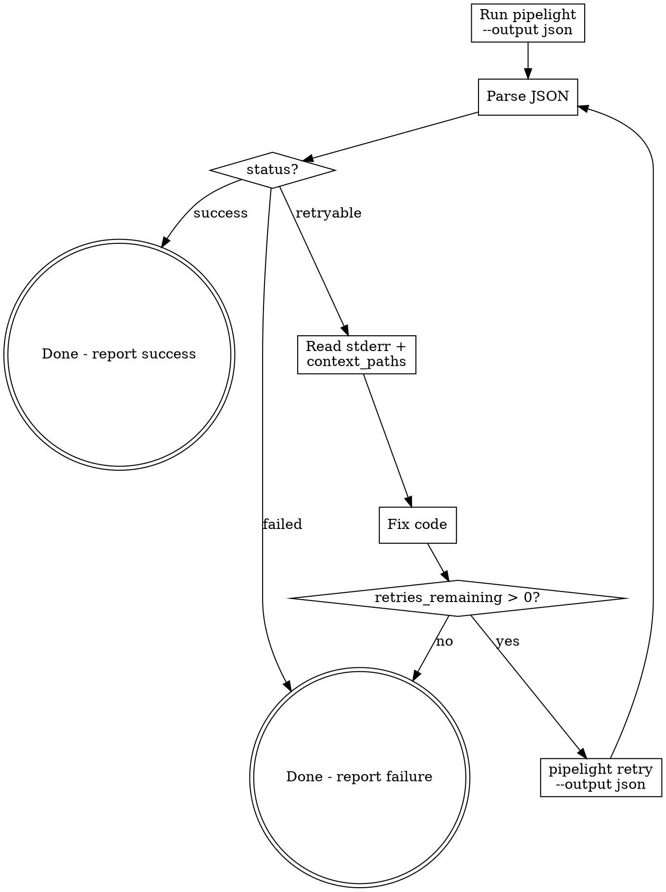

# /pipelight-run

## Step 0: Load Skill Memory (MANDATORY)

Before doing anything else, read every `*.md` file under this skill's `memory/` directory (i.e. `<dir-of-this-SKILL.md>/memory/*.md`). Treat each file's contents with the same authority as a user-supplied auto-memory entry — the `feedback` type files encode hard-learned rules that MUST shape how you dispatch callbacks, format reports, and decide when to retry.

If the `memory/` directory is missing or empty, skip this step silently. Never skip it because "I remember what's in there" — memories evolve; read the current version each run.

## Overview

Pipelight is the project's lightweight CLI CI/CD tool. This skill defines the interaction protocol: run pipeline with JSON output, parse results, auto-fix on retryable failures, and retry until success or exhaustion.

## When to Use

- User says "run pipeline" / "build" / "CI check" / "pipelight"
- User wants to verify code changes compile/pass tests
- After making code changes that need validation
- When a previous pipelight run returned `retryable` and you need to fix + retry

## Core Flow



## Arguments

| Argument | Description | Example |
|----------|-------------|---------|
| `--reinit` | Force regenerate `pipeline.yml` before running | `/pipelight-run --reinit` |
| `--skip <steps>` | Skip one or more steps (comma-separated) | `/pipelight-run --skip spotbugs,pmd` |
| `--step <name>` | Run only a specific step | `/pipelight-run --step build` |
| `--dry-run` | Show execution plan without running | `/pipelight-run --dry-run` |
| `--verbose` | Show full container output | `/pipelight-run --verbose` |
| `--docker-prepare` | Pull all Docker images from pipeline.yml without running pipeline | `/pipelight-run --docker-prepare` |
| `--clean` | Remove pipeline.yml and pipelight-misc/ from current project | `/pipelight-run --clean` |
| `--ping-pong` | Enable ping-pong communication test step (inactive by default) | `/pipelight-run --ping-pong` |
| `--full-report-only` | Force full-scan + report-only mode for lint/scan steps (e.g. PMD). Bypasses incremental git-diff; violations do NOT trigger auto_fix | `/pipelight-run --full-report-only` |
| `--git-diff-from-remote-branch=<remote-branch>` | 指定远程分支作为 branch-ahead 对比基准（如 `origin/main`），替代默认的 `@{upstream}`。详见下方说明 | `/pipelight-run --git-diff-from-remote-branch=origin/main` |

Arguments can be combined: `/pipelight-run --reinit --skip pmd --verbose`

### `--git-diff-from-remote-branch=<remote-branch>`

- `--git-diff-from-remote-branch=<remote-branch>`: 指定远程分支作为 branch-ahead
  对比基准（如 `origin/main`），替代默认的 `@{upstream}`。用于在"从主分支切出的
  feature 分支"上只对自迁出以来改动过的文件运行代码质量扫描（PMD / SpotBugs /
  JaCoCo）。不传此 flag 时 pipelight 使用 `@{upstream}`，与原行为一致。
  - 典型用法：`pipelight run --git-diff-from-remote-branch=origin/main`
  - 要求 ref 本地已 fetch；不存在时 pipeline 终止并触发 `runtime_error` 回调，
    提示用户运行 `git fetch` 后重试
  - 值必须是完整的 remote ref（`origin/<branch>`），不要裸写分支名
  - `retry` 子命令也支持同名 flag；若不传，则继承原 run 持久化的值

## Full-Scan Mode (`--full-report-only`)

By default, PMD (both Maven and Gradle) runs in **incremental mode**: scans only the source files (`*.java` / `*.kt`) changed on the current branch — unstaged working tree + staged + unpushed commits — and triggers `auto_fix` on violations.

When `--full-report-only` is passed, pipelight sets `PIPELIGHT_FULL_REPORT_ONLY=1` on every step and persists the flag into `RunState`, so subsequent `pipelight retry` invocations inherit it automatically. PMD (Maven & Gradle) switches into **full-scan + report-only mode**:

- Scans the entire project source tree (e.g. all `src/main/{java,kotlin}` directories)
- Generates a complete PMD report at `pipelight-misc/pmd-report/`
- **Always exits 0** regardless of violation count — the step never fails the pipeline
- Violations do **NOT** trigger `auto_fix`; the LLM must not attempt to fix violations reported in this mode

Use `--full-report-only` when you want a one-shot complete quality report across the whole codebase (e.g. before a release cut, or to get a baseline) without blocking the pipeline or mutating source files.

## Clean Mode

When `--clean` is passed, **do NOT run the pipeline**. Instead run:

```bash
pipelight clean
```

This removes `pipeline.yml` and `pipelight-misc/` from the current project directory. Does not affect global cache (`~/.pipelight/cache/`).

## Docker Prepare Mode

When `--docker-prepare` is passed, **do NOT run the pipeline**. Instead:

1. Check `pipeline.yml` exists (generate if needed, same as Step 1)
2. Parse `pipeline.yml` and collect all unique `image` values from steps (skip steps with `local: true` or empty image)
3. For each image, run `docker pull <image>` and report progress
4. Report summary of pulled images

This is useful when the user needs to pre-pull images on a network that can reach Docker Hub (e.g. before connecting to a VPN that blocks it).

```bash
# Example flow:
docker pull rust:latest
docker pull alpine/git:latest
# ... etc
```

After `--docker-prepare` completes, the user can switch networks and run `/pipelight-run` normally — Docker will use cached images.

## Step 1: Check pipeline.yml Exists

If the project has no `pipeline.yml`, **or the user passed `--reinit`**, generate one:

```bash
pipelight init -d .
```

When `--reinit` is used, this overwrites the existing `pipeline.yml` with a freshly detected configuration.

Review the generated file and adjust if needed.

## Step 2: Run Pipeline

```bash
pipelight run -f pipeline.yml --output json --run-id <short-id>
```

- Always use `--output json` so output is machine-parseable
- Always provide `--run-id` (e.g. `run-001`) to enable retry
- Use `-f` to point to the correct pipeline file if not `pipeline.yml`
- If `--skip` was passed, add `--skip <step1> <step2>` to skip those steps
- If `--step` was passed, add `--step <name>` to run only that step
- If `--dry-run` was passed, add `--dry-run` to show plan without executing
- If `--verbose` was passed, add `--verbose` to show full container output
- If `--ping-pong` was passed, add `--ping-pong` to activate the ping-pong communication test step
- If `--full-report-only` was passed, add `--full-report-only` to force full-scan + report-only mode on lint/scan steps

## Step 3: Parse JSON Result

**IMPORTANT: 每次收到 pipelight 的 JSON 输出（包括首次运行和每次 retry），都必须将完整 JSON 原文打印给用户。** 使用 JSON code block 展示，让用户能看到 LLM 与 pipelight 之间的每一次完整交互。如果 JSON 输出过大被截断，则从工具结果文件中提取关键字段（run_id, status, 每个 step 的 name/status/report_summary/stderr）并以 JSON 格式打印。

JSON structure:

```json
{
  "run_id": "run-001",
  "pipeline": "rust-ci",
  "status": "success | failed | retryable",
  "duration_ms": 5000,
  "steps": [
    {
      "name": "build",
      "status": "success | failed | skipped | pending | running",
      "exit_code": 0,
      "duration_ms": 3000,
      "image": "rust:1.78-slim",
      "command": "cargo build --release",
      "stdout": "...",
      "stderr": "...",
      "error_context": { "files": [...], "lines": [...], "error_type": "..." },
      "on_failure": {
        "exception_key": "compile_error | ruleset_not_found | ruleset_invalid | unrecognized",
        "command": "auto_fix | auto_gen_pmd_ruleset | git_fail | fail_and_skip | runtime_error | abort",
        "action": "retry | skip | runtime_error | abort",
        "max_retries": 3,
        "retries_remaining": 3,
        "context_paths": ["src/", "Cargo.toml"]
      },
      "test_summary": { "passed": 42, "failed": 3, "skipped": 1 },
      "report_summary": "Compiled successfully",
      "report_path": "pipelight-misc/build-20260410T002026.log"
    }
  ]
}
```

## Step 4: Act on Status

### `status: "success"`

Report success to user with a summary table including Step, Status, and Summary columns. The Summary column shows each step's `report_summary` field from the JSON output.

Example:

| Step | Status | Summary |
|------|--------|---------|
| git-pull | skipped | — |
| build | success | Compiled successfully |
| pmd | success | PMD Total: 0 violations |
| spotbugs | success | SpotBugs Total: 0 bugs found |
| test | success | Tests: 42 passed, 0 failed |
| package | success | Packaged successfully |

**Important:** even under `status: "success"`, a step may still carry an `on_failure.command` asking you to print a post-run report (e.g. `git_diff_command`, `test_print_command`, `pmd_print_command`, `spotbugs_print_command` from report-only steps). After rendering the summary table, look at every step's `on_failure` field — if `action` is `git_diff_report`, `test_print`, `pmd_print`, or `spotbugs_print`, dispatch via the callback table below. These are pure reporting actions; the pipeline has already continued.

### `status: "failed"`

Pipeline failed with no auto-fix strategy. Report the error:
- Show which step failed
- Show `stderr` content
- Show `error_context` if present
- Do NOT attempt auto-fix (strategy is `abort` or `notify`)

### `status: "retryable"`

Pipeline failed but auto-fix is configured.**先查回调命令处理表确定 LLM 操作，再进入 fix-retry loop。**

#### 回调命令处理表 (Callback Command Dispatch)

当 step 失败且 `status: "retryable"` 时，读取失败 step 的 `on_failure.command` 字段，按下表分发 LLM 操作：

| `command` | action | LLM 操作 | 成功后 | 失败后 |
|-----------|--------|---------|--------|--------|
| `auto_fix` | retry | 见下方 **`auto_fix` 详细流程** | `pipelight retry` 重试该 step | retries 耗尽则报告失败 |
| `auto_gen_pmd_ruleset` | retry | 见下方 **`auto_gen_pmd_ruleset` 详细流程** | `pipelight retry` 重试该 step | skip PMD: `pipelight retry --skip pmd` |
| `ping` | retry | 在终端打印 `pong`，然后 `pipelight retry` 重试该 step | `pipelight retry` 重试该 step | 10 轮完成后 step 自动成功 |
| `test_print_command` | test_print | 见下方 **`test_print` 详细流程** | 打印完表格，pipeline 已继续，无 retry | — |
| `pmd_print_command` | pmd_print | 见下方 **`pmd_print` 详细流程** | 打印完表格，pipeline 已继续，无 retry | — |
| `spotbugs_print_command` | spotbugs_print | 见下方 **`spotbugs_print` 详细流程** | 打印完表格，pipeline 已继续，无 retry | — |
| `git_diff_command` | git_diff_report | 见下方 **`git_diff_report` 详细流程** | 打印完表格，pipeline 已继续，无 retry | — |
| `auto_gen_jacoco_config` | retry | 在 `pipelight-misc/` 下生成 `jacoco-config.yml`（含 `threshold: 70` 和排除 glob 列表），然后 retry 该 step | step 通过 | 见下方 **`auto_gen_jacoco_config` 详细流程** |
| `jacoco_print_command` | jacoco_print | 解析 `pipelight-misc/jacoco-full-report/jacoco.xml`，按 package 分组打印每个 source file 的 LINE 覆盖率百分比 + 总结统计（≥70% / <70% 数量） | 打印完表格，pipeline 已继续，无 retry | — |
| `git_fail` | skip | 无操作（pipelight 已自动 skip） | pipeline 继续 | — |
| `fail_and_skip` | skip | 无操作（pipelight 已自动 skip） | pipeline 继续 | — |
| `runtime_error` | runtime_error | 报告错误，不重试 | — | — |
| `abort` | abort | 报告错误，不重试 | — | — |

#### `ping` 详细流程

Ping-pong 通信测试，验证 pipelight 与 LLM 的回调交互是否正常。

**重要：每一轮 ping-pong 都必须独立展示，禁止压缩或合并多轮显示。** 每轮必须包含：
1. 轮次标题（`### Round N`）
2. 完整的 JSON 输出（或关键字段摘要）
3. LLM 的 `pong` 响应
4. retry 命令

逐轮流程：

1. 读取失败 step 的 `stdout`，确认包含 `ping (round N/10)`
2. 打印轮次标题：`### Round N: ping (round N/10)`
3. 打印该轮的 JSON 输出（至少包含 step name、status、stdout、retries_remaining）
4. **在终端打印 `pong`**（直接输出文本 "pong" 给用户看）
5. 执行 `pipelight retry --run-id <id> --step ping-pong -f pipeline.yml --output json`（每轮一次独立的 Bash 调用，不要用 for 循环批量执行）
6. 解析 JSON，如果 step 再次失败且 `on_failure.command` 仍为 `ping`，重复步骤 1-5
7. 第 10 轮时 step 会自动 exit 0（成功），pipeline 继续执行下一个 step

> **注意**：ping 回调不需要读取任何文件或修改代码，仅打印 pong 并 retry。
> **禁止**：用 for/while 循环批量执行多轮 retry，或将多轮合并为一条输出。每轮都是一次独立的 LLM ↔ pipelight 交互，必须逐轮展示。

#### `auto_fix` 详细流程

**每轮 fix-retry 循环都必须打印给用户**，让用户看到完整的诊断 → 修复 → 重试过程。

1. 找到失败的 step（`status: "failed"` 的那个）
2. **打印诊断信息**：

```
### <step-name> failed (command: auto_fix, N retries remaining)

**Error:** <one-line error summary from stderr>
**File:** <file:line if available from error_context or stderr>
```

3. 读 `stderr` 理解错误原因
4. 读 `on_failure.context_paths` 中列出的文件，理解上下文
5. 定位源码，修复 bug
6. **打印修复内容**：

```
**Cause:** <root cause explanation>
**Fix:** <what you changed>
**Files modified:**
- `path/to/file.java` — <brief description of change>
```

7. 检查 `retries_remaining > 0`，为 0 则报告失败，不再重试
8. 重试：

```bash
pipelight retry --run-id <same-run-id> --step <failed-step-name> -f pipeline.yml --output json
```

9. 解析新的 JSON 结果，回到 Step 4 的状态判断（success/failed/retryable）
10. 如果多轮重试，每轮编号：`### Round 1`、`### Round 2`...

#### `auto_gen_pmd_ruleset` 详细流程

搜索分两轮，优先复用项目已有配置，找不到才从编码规范文档生成：

**第一轮：搜索项目中已有的 PMD 配置文件**（直接复制到 `<项目根>/pipelight-misc/pmd-ruleset.xml` 使用）
- 搜索 `**/pmd-ruleset.xml`、`**/pmd.xml`、`**/config/pmd/*.xml`
- 检查 `pom.xml` 中 `maven-pmd-plugin` 引用的 ruleset 路径
- 检查 `build.gradle` 中 `pmd { ruleSetFiles = ... }` 引用的文件
- **禁止**使用 `target/` 或 `build/` 目录下的文件（构建产物，不可靠）
- 找到 → 复制到 `pipelight-misc/pmd-ruleset.xml` → retry

**第二轮：搜索编码规范文档**（读取内容后生成 PMD ruleset XML）
- 不要假设特定规范（如阿里巴巴、Google 等），根据实际文档内容生成
- 搜索路径优先级：`doc/` → `docs/` → 项目根目录下的 `*规范*`、`*guideline*`、`*coding*` 文件
- 支持 PDF/MD 格式，任何语言
- 找到 → 读取内容，生成 `pipelight-misc/pmd-ruleset.xml`（使用 PMD 7.x 规则名） → retry

**两轮都找不到** → 立即 skip PMD：新起 pipeline `pipelight run -f pipeline.yml --output json --run-id <new-id> --skip pmd`。**禁止 LLM 在没有找到任何已有配置或编码规范文档的情况下凭空生成 ruleset 文件。**

**注意：`pipelight-misc/` 必须位于目标项目根目录下**（即 `pipeline.yml` 所在目录），而非 pipelight 工具自身的目录。

#### `auto_gen_jacoco_config` 详细流程

1. **读上下文**：LLM 读 `on_failure.context_paths` 指向的 source_paths（项目源码目录），判断项目规模和框架类型。

2. **识别项目约定**：扫描 `src/main/java/`（或 kotlin）下的文件命名模式，找出常见的 DTO/Config/Exception/Entity 类。典型模式：
   - `*Dto.java` / `*DTO.java`（数据传输对象，仅 getter/setter，无业务逻辑）
   - `*Config.java` / `*Configuration.java`（Spring 配置类）
   - `*Exception.java`（异常类，仅构造器）
   - `*Application.java`（Spring Boot 入口类）
   - `**/generated/**`（构建时生成的代码）
   - 可根据项目实际加入更多模式（如 `*Mapper.java`、`*Enum.java`、`*Controller.java`）

3. **写配置**：生成 `pipelight-misc/jacoco-config.yml`，默认模板：

   ```yaml
   # JaCoCo 覆盖率检查配置
   # 被 pipelight 的 jacoco / jacoco_full step 读取

   # 每个文件的 LINE 覆盖率下限（百分比）
   threshold: 70

   # 排除在覆盖率检查外的文件 glob（相对项目根）
   exclude:
     - "**/*Dto.java"
     - "**/*DTO.java"
     - "**/*Config.java"
     - "**/*Configuration.java"
     - "**/*Exception.java"
     - "**/*Application.java"
     - "**/generated/**"
   ```

4. **LLM 打印**：`Generated pipelight-misc/jacoco-config.yml (threshold=70, N excludes).`

5. **retry**：`pipelight retry --step jacoco`。

#### `jacoco_print_command` 详细流程

触发于 `jacoco_full` step（`--full-report-only` 模式），全仓扫描发现有文件 LINE 覆盖率 < threshold 时。report-only：不修代码、不 retry。

1. **读 XML**：`pipelight-misc/jacoco-full-report/jacoco.xml`。
2. **读 summary 文本**：`jacoco-summary.txt`（每行 `path X.Y%`）和 `threshold-fail.txt`（未达标文件）。
3. **按 package 分组打印**：每行格式 `  <file>  <pct>%`，未达标的加 `⚠ below threshold` 标记。末尾给出汇总：总文件数、达标数、未达标数、平均覆盖率。

示例输出：

```
=== JaCoCo Full Report (threshold=70%) ===

com.foo.user:
  UserService.java          82.5%
  UserController.java       91.2%

com.foo.order:
  OrderService.java         63.1%  ⚠ below threshold
  OrderRepository.java      95.0%

Total: 4 files — 3 pass, 1 fail — avg 82.9%
```

#### `test_print` 详细流程

`test_print` 是 post-run 打印型 action（由 `test_print_command` 触发），**每次 test step 跑完都会发出**（成功或失败），用于让 LLM 打印汇总。pipeline 已经判定完毕，**不 retry**。

**分两种场景**，按 `on_failure.context_paths` 是否为空分流：

**场景 A：JUnit XML 多模块聚合**（context_paths 非空 — Maven/Gradle）

1. 从 `on_failure.context_paths` 读 glob：
   - Gradle：`**/build/test-results/test/*.xml`、`**/build/reports/tests/test/index.html`
   - Maven：`**/target/surefire-reports/TEST-*.xml`、`**/target/failsafe-reports/TEST-*.xml`
2. 在**项目根目录**（`pipeline.yml` 所在目录）下用 glob 枚举所有 JUnit XML 报告
3. 解析每个 XML 的 `<testsuite tests="N" failures="F" errors="E" skipped="S">` 属性
4. 按模块聚合（模块路径 = XML 文件路径去掉 `build/test-results/test/...` 或 `target/surefire-reports/...` 后缀）
5. 打印一张 Markdown 表格，列：模块 / Tests / Passed / Failed / Skipped；失败模块行前缀 `✗`，通过模块前缀 `✓`；末尾加一行「总计」
6. 表格下方用 2-3 句话点明：本次实际跑了多少模块（vs 被 gradle/maven cache 判定 UP-TO-DATE 未重跑的模块数，可从 stdout 的 `N executed, M up-to-date` 提取；没有就不提），以及最常见的失败根因（从 XML 的 `<failure message="...">` 提炼一条）

**场景 B：日志回退汇总**（context_paths 为空 — Rust/Go/Node/Python 等非 JUnit 框架）

1. 从 step JSON 的 `report_path` 字段拿日志路径（形如 `pipelight-misc/test-20260414T153734.log`，路径相对 `pipeline.yml` 所在目录）
2. 读取该日志文件（Read 工具）
3. 按语言识别测试汇总行并正则提炼数字：
   - Rust (`cargo test`)：`test result: \w+\. (\d+) passed; (\d+) failed; (\d+) ignored` — 多个 test binary 时把所有匹配相加
   - Go (`go test`)：`--- PASS:` / `--- FAIL:` / `--- SKIP:` 各自计数；或者末尾 `ok` / `FAIL` 汇总行
   - Node/Jest：`Tests:       N passed, M failed, K skipped, T total`
   - Python/pytest：`===== N passed, M failed, K skipped in X.XXs =====`
4. 打印一行汇总：`Tests: N passed, M failed, K skipped`
5. 若 `M > 0`，再从日志提取前 3 条失败测试名与错误首行，附在下方

**两种场景都一样**：

- 无 retry 步骤（纯报告）
- 不要修源码；若用户明确要求修，再按常规编辑流程

#### `pmd_print` 详细流程

`pmd_print` 是 PMD 的 post-run 打印型 action（由 `pmd_print_command` 触发）。当 PMD 扫到违规时 pipelight 把报告路径写进 `on_failure.context_paths`，LLM 只做报告，**不修代码、不 retry**。

1. 从 `on_failure.context_paths` 读路径（已经给好）：
   - `pipelight-misc/pmd-report/pmd-result.xml` — 原始结构化报告
   - `pipelight-misc/pmd-report/pmd-summary.txt` — pipelight 预生成的文本摘要（可直接引用）
2. 解析 `pmd-result.xml`，聚合 `<violation rule="..." ruleset="..." priority="..." beginline="...">` 节点
3. 打印两张 Markdown 表格：
   - **按规则**：规则名 / 触发次数 / 优先级 / 示例文件:行号（取首个）
   - **按文件（Top 10）**：文件路径 / 违规条数（含最高优先级）
4. 表格上方用一行标明：`PMD Total: N violations（扫描 K 个文件）` — N 取自 stdout 的 `PMD Total:`，K 取自 `Scanned files:`
5. 若 violations 为 0 则不用打印任何表（callback 本来也不会触发）

> **注意**：不要尝试修改源码。若用户明确要求修复，再按常规编辑流程处理，但那不是 pmd_print 的职责。

#### `spotbugs_print` 详细流程

`spotbugs_print` 是 SpotBugs 的 post-run 打印型 action（由 `spotbugs_print_command` 触发）。流程与 pmd_print 同构。

1. 从 `on_failure.context_paths` 读路径：
   - `pipelight-misc/spotbugs-report/spotbugs-result.xml`
   - `pipelight-misc/spotbugs-report/spotbugs-summary.txt`
2. 解析 `spotbugs-result.xml` 的 `<BugInstance type="..." priority="..." category="...">` 与子节点 `<Class classname="..."><SourceLine sourcefile="..." start="..." />` 等
3. 打印三张表：
   - **按 Category**：category / 次数
   - **按 Priority**：priority (1=High / 2=Medium / 3=Low) / 次数
   - **Top 10 Bug Types**：type / 次数 / 示例 class:line
4. 表格上方一行：`SpotBugs Total: N bugs found`（取自 stdout）
5. **不修代码、不 retry**

> **注意**：Priority 1 (High) 的 Bug 若涉及安全类（SQL 注入、XSS 等），在表下方简短点出 1-2 行告警，但仍然只是报告，不自动改代码。

#### `git_diff_report` 详细流程

`git_diff_report` 是 `git-diff` step 的 post-run 打印型 action（由 `git_diff_command` 触发）。当工作区或本地有改动时 pipelight 把单一汇总清单写进 `on_failure.context_paths`，LLM 只做汇报，**不修代码、不 retry**。

若 step 因 "not a git repository" 或 "working tree clean and no branch-ahead commits" 而 skipped，`on_failure` 仍为 null（不会触发本 action）。

1. 从 `on_failure.context_paths` 读文件清单：
   - `pipelight-misc/git-diff-report/diff.txt` — 单一汇总文档，当前分支所有变更文件的去重路径列表
   - `pipelight-misc/git-diff-report/base-ref.txt`（**可选**）— 当用户传了 `--git-diff-from-remote-branch=<ref>` 时出现；单行写入本次使用的 base ref。
2. step stdout 仍会打印分类统计（unstaged / staged / untracked / branch-ahead）供人类阅读。
3. **终端打印 markdown 清单**（始终执行，无论 base-ref.txt 是否存在）：

```markdown
### git-diff: 5 unique file(s) changed on current branch

- unstaged: 2
- staged: 1
- untracked: 0
- branch-ahead (vs origin/main): 2

**Files:**
- src/foo.rs
- src/bar.rs
- ...
```

4. **HTML 报告生成**（**仅当 context_paths 含 base-ref.txt 时**执行）：

   运行 bundled 工具生成一份独立 HTML review artifact：

```bash
python3 ~/.claude/skills/pipelight-run/tools/gen_diff_html.py \
    --input pipelight-misc/git-diff-report/diff.txt \
    --base-ref-file pipelight-misc/git-diff-report/base-ref.txt \
    --output pipelight-misc/git-diff-report/diff.html \
    --cwd <repo-root>
```

   - 成功（退出 0）→ 打印一行提示，如 `HTML report: pipelight-misc/git-diff-report/diff.html (open in browser for review)`
   - 失败（退出非 0）→ 把 stderr 打印到终端；注明 `HTML report failed; Markdown list above is the complete output`；**不 retry pipelight、不 abort pipeline**（HTML 是人工 review 附加品，不影响 CI 判定）
   - Pygments 未安装导致的失败 → 提示用户跑 `/pipelight-sync` 或手动 `python3 -m pip install --user pygments`

5. **不修代码、不 retry**，打印完继续下一 step 的分发。

### Success Report (after retries)

When the pipeline eventually succeeds after one or more fix-retry rounds, the final summary table MUST include an **Auto-fix History** section below the step table, listing all files that were modified during the fix-retry loop:

Example:

| Step | Status | Summary |
|------|--------|---------|
| build | success | Compiled successfully |
| pmd | success | PMD Total: 0 violations |
| test | success | Tests: 42 passed, 0 failed |

**Auto-fix History (1 round):**
- `src/com/example/Foo.java:128` — removed stray junk text `ddddddd` causing syntax error
- `src/com/example/Bar.java:45` — fixed missing semicolon

If no auto-fix occurred (pipeline passed on first run), omit this section entirely.

## Guardrails

### Never Execute Pipeline Commands Directly

When a step fails, you must ONLY:
1. Read stderr and context_paths to understand the error
2. Fix the source code (edit files)
3. Retry via `pipelight retry`

**NEVER** execute pipeline step commands directly on the host (e.g., `cargo fmt`, `cargo build`, `mvn compile`, `npm run build`). All step commands must run through the pipelight pipeline inside Docker containers.

**Why:** Direct execution bypasses Docker isolation, skips the pipeline's reporting/retry mechanism, and produces results that differ from the pipeline environment. It also creates local file modifications that the user didn't ask for.

**What to do instead:**
- If `status: "retryable"` → enter fix-retry loop (edit code, then `pipelight retry`)
- If `status: "failed"` (non-retryable) → report the error, do NOT attempt to fix

## Exit Code Reference

| Exit Code | Meaning |
|-----------|---------|
| 0 | Pipeline succeeded |
| 1 | Pipeline retryable (has auto_fix steps with retries left) |
| 2 | Pipeline failed (abort/notify, or retries exhausted) |

## Common Mistakes

| Mistake | Correct Approach |
|---------|-----------------|
| Omit `--output json` | Always use `--output json` for machine parsing |
| Omit `--run-id` | Always set `--run-id` so retry can reference it |
| Retry without `--step` | `--step` is required for retry command |
| Retry when `retries_remaining == 0` | Check before retrying, report failure instead |
| Fix code without reading `context_paths` | Always read context files first for full understanding |
| Retry `failed` (non-retryable) pipeline | Only retry when status is `retryable` |
| Execute step commands directly (e.g., `cargo fmt`) | Only fix source code and retry via `pipelight retry`. Never run step commands outside the pipeline |
