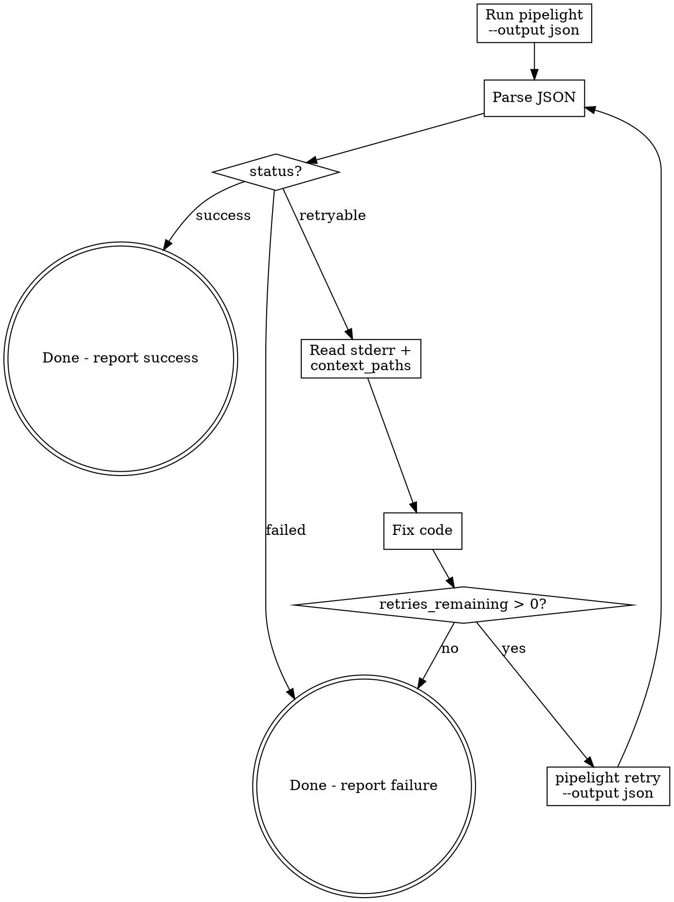
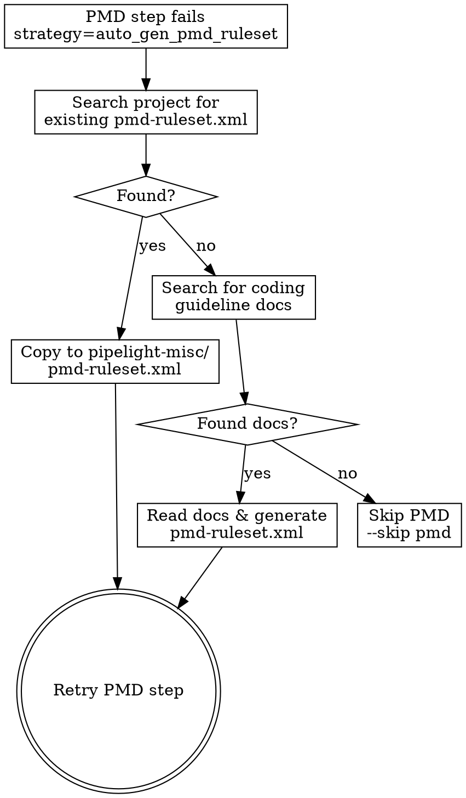

# /pipelight-run

## Overview

Pipelight is the project's lightweight CLI CI/CD tool. This skill defines the interaction protocol: run pipeline with JSON output, parse results, auto-fix on retryable failures, and retry until success or exhaustion.

## When to Use

- User says "run pipeline" / "build" / "CI check" / "pipelight"
- User wants to verify code changes compile/pass tests
- After making code changes that need validation
- When a previous pipelight run returned `retryable` and you need to fix + retry

## Core Flow



## Arguments

| Argument | Description | Example |
|----------|-------------|---------|
| `--clean` | Remove all pipelight artifacts (pipeline.yml, pipelight-misc/) and stop. When combined with other flags (e.g. `--reinit`), clean first then continue. | `/pipelight-run --clean` |
| `--reinit` | Force regenerate `pipeline.yml` before running | `/pipelight-run --reinit` |
| `--skip <steps>` | Skip one or more steps (comma-separated) | `/pipelight-run --skip spotbugs,pmd` |
| `--step <name>` | Run only a specific step | `/pipelight-run --step build` |
| `--dry-run` | Show execution plan without running | `/pipelight-run --dry-run` |
| `--verbose` | Show full container output | `/pipelight-run --verbose` |
| `--list-steps` | List all detected steps without running | `/pipelight-run --list-steps` |

Arguments can be combined: `/pipelight-run --clean --reinit --skip pmd --verbose`

## Step 0: Handle --clean and --list-steps

If the user passed `--clean`, run clean to remove all pipelight artifacts:

```bash
pipelight clean -d <project-dir>
```

This removes `pipeline.yml` and `pipelight-misc/` from the target project.

**If `--clean` is the only flag** (no `--reinit`, `--skip`, `--step`, etc.), **stop here** — report the clean result and do not proceed to init or run.

**If `--clean` is combined with other flags** (e.g. `--clean --reinit`, `--clean --skip pmd`), clean first then continue to Step 1. In this case `--reinit` is implicit since clean already removes `pipeline.yml`.

If the user passed `--list-steps`, run:

```bash
pipelight --list-steps --dir <project-dir>
```

Report the output to the user and **stop here** — do not proceed to run the pipeline.

## Step 1: Check pipeline.yml Exists

If the project has no `pipeline.yml`, **or the user passed `--reinit`**, generate one:

```bash
pipelight init -d .
```

When `--reinit` is used, this overwrites the existing `pipeline.yml` with a freshly detected configuration.

Review the generated file and adjust if needed.

## Step 2: Run Pipeline

```bash
pipelight run -f pipeline.yml --output json --run-id <short-id>
```

- Always use `--output json` so output is machine-parseable
- Always provide `--run-id` (e.g. `run-001`) to enable retry
- Use `-f` to point to the correct pipeline file if not `pipeline.yml`
- If `--skip` was passed, add `--skip <step1> <step2>` to skip those steps
- If `--step` was passed, add `--step <name>` to run only that step
- If `--dry-run` was passed, add `--dry-run` to show plan without executing
- If `--verbose` was passed, add `--verbose` to show full container output

## Step 3: Parse JSON Result

JSON structure:

```json
{
  "run_id": "run-001",
  "pipeline": "rust-ci",
  "status": "success | failed | retryable",
  "duration_ms": 5000,
  "steps": [
    {
      "name": "build",
      "status": "success | failed | skipped | pending | running",
      "exit_code": 0,
      "duration_ms": 3000,
      "image": "rust:1.78-slim",
      "command": "cargo build --release",
      "stdout": "...",
      "stderr": "...",
      "error_context": { "files": [...], "lines": [...], "error_type": "..." },
      "on_failure": {
        "callback_command": "auto_fix | auto_gen_pmd_ruleset | abort | notify",
        "max_retries": 3,
        "retries_remaining": 3,
        "context_paths": ["src/", "Cargo.toml"]
      },
      "test_summary": { "passed": 42, "failed": 3, "skipped": 1 }
    }
  ]
}
```

## Step 4: Act on Status

### `status: "success"`

Report success to user. Show step durations if relevant.

### `status: "failed"`

Pipeline failed with no auto-fix strategy. Report the error:
- Show which step failed
- Show `stderr` content
- Show `error_context` if present
- Do NOT attempt auto-fix (strategy is `abort` or `notify`)

### `status: "retryable"`

Pipeline failed but auto-fix is configured. Enter fix-retry loop:

1. Find the failed step (the one with `status: "failed"`)
2. Read `stderr` to understand the error
3. Read files listed in `on_failure.context_paths` to understand context
4. Fix the code
5. Check `retries_remaining > 0` before retrying
6. Run retry:

```bash
pipelight retry --run-id <same-run-id> --step <failed-step-name> -f pipeline.yml --output json
```

7. Parse the new JSON result and repeat from Step 4

## Exit Code Reference

| Exit Code | Meaning |
|-----------|---------|
| 0 | Pipeline succeeded |
| 1 | Pipeline retryable (has auto_fix steps with retries left) |
| 2 | Pipeline failed (abort/notify, or retries exhausted) |

## Pipelight-misc Convention

Pipelight uses a `pipelight-misc/` directory for all CI artifacts and config files.**This directory MUST be located at the root of the target project** — the same directory where `pipeline.yml` resides and where `pipelight run` is executed. Pipelight auto-creates this directory on first run.

**CRITICAL:** When creating config files (ruleset, exclusion filters), always use the **absolute path** to the target project's `pipelight-misc/` directory. If the target project is at `/path/to/my-app/`, the correct path is `/path/to/my-app/pipelight-misc/pmd-ruleset.xml`. Do NOT place files relative to your current working directory if it differs from the target project root.

| File | Correct Path | Wrong Path |
|------|-------------|------------|
| PMD ruleset | `<project-root>/pipelight-misc/pmd-ruleset.xml` | `src/pmd-ruleset.xml` or `<other-dir>/pipelight-misc/` |
| SpotBugs exclusions | `<project-root>/pipelight-misc/spotbugs-exclude.xml` | `src/spotbugs-exclude.xml` |
| Error logs | `<project-root>/pipelight-misc/<step>.log` | (auto-generated by pipelight) |
| PMD reports | `<project-root>/pipelight-misc/pmd-report/` | (auto-generated by pipelight) |
| SpotBugs reports | `<project-root>/pipelight-misc/spotbugs-report/` | (auto-generated by pipelight) |

The Docker container mounts the target project root to `/workspace`, so `<project-root>/pipelight-misc/pmd-ruleset.xml` becomes `/workspace/pipelight-misc/pmd-ruleset.xml` inside the container. The pipeline steps reference this absolute container path.

**How to find the target project root:** It is the directory containing `pipeline.yml`. When the pipelight-run skill is invoked, determine this path first:

```bash
# The project root is where pipeline.yml lives
PROJECT_ROOT="$(dirname "$(realpath pipeline.yml)")"
```

## Auto-fix Boundaries

When auto-fixing failures, you may ONLY modify **application source code** (`.java`, `.py`, `.rs`, `.ts`, etc.). You must NEVER modify:

| Off-limits file | Why |
|----------------|-----|
| `pom.xml` | Build config — adding/removing plugins or dependencies changes the project's build semantics |
| `build.gradle` / `build.gradle.kts` | Same reason |
| `Cargo.toml` | Same reason |
| `package.json` | Same reason |
| `requirements.txt` / `pyproject.toml` | Same reason |
| `pipeline.yml` | Pipeline config — should only be regenerated via `pipelight init` |

**If a quality check step (PMD, SpotBugs, Checkstyle) fails because the plugin is not configured in the build file, do NOT add the plugin to `pom.xml` or `build.gradle`. Instead, report the failure and suggest the user either:**
1. Add the plugin to their build config themselves, or
2. Re-run with `--skip pmd,spotbugs` to skip those steps

**The only files auto-fix should create** are pipelight-misc config files (`pmd-ruleset.xml`, `spotbugs-exclude.xml`) to tune rule severity — never project build files.

## PMD Callback Protocol: `auto_gen_pmd_ruleset`

When the PMD step fails with `callback_command: "auto_gen_pmd_ruleset"` and stderr contains `PIPELIGHT_CALLBACK:auto_gen_pmd_ruleset`, this is a **callback** — pipelight is asking the LLM to find or generate a PMD ruleset before retrying.

### Callback Flow



### Step 1: Search for Existing PMD Configuration

Search the project for **any existing PMD configuration** — the project may already have PMD set up. Check in this priority order:

```
# Priority 1: Standalone PMD ruleset files
**/pmd-ruleset.xml
**/pmd.xml
**/config/pmd/*.xml
**/ruleset.xml  (only in directories that suggest PMD context, e.g. config/pmd/)

# Priority 2: Build tool PMD plugin config (extract the ruleset path)
pom.xml → look for <artifactId>maven-pmd-plugin</artifactId> → <rulesets><ruleset>path</ruleset>
build.gradle / build.gradle.kts → look for pmd { ruleSetFiles = ... }

# Priority 3: PMD config in module subdirectories
**/pmd-ruleset.xml
module-*/config/pmd/*.xml
```

**IMPORTANT:** Do NOT use files under `target/` or `build/` directories — those are build artifacts and unreliable.

If a standalone ruleset file is found:
1. Copy it to `<project-root>/pipelight-misc/pmd-ruleset.xml`
2. Retry the PMD step

If a build tool references a ruleset path (e.g. `<ruleset>config/pmd/custom-rules.xml</ruleset>`):
1. Locate that file and copy it to `<project-root>/pipelight-misc/pmd-ruleset.xml`
2. Retry the PMD step

### Step 2: Search for Coding Guideline Documents

If no PMD ruleset file exists, search for coding standard/guideline documents:

```
# Search patterns (English):
**/coding-guide*.md
**/coding-guide*.pdf
**/coding-standard*.md
**/coding-standard*.pdf
**/code-style*.md
**/code-style*.pdf
**/CONTRIBUTING.md (may contain code style section)
**/style-guide*.md
**/checkstyle*.xml (can be partially converted)

# Search patterns (Chinese — 中文命名):
**/*编码规范*.md
**/*编码规范*.pdf
**/*代码规范*.md
**/*代码规范*.pdf
**/*编码标准*.md
**/*开发规范*.md
**/*代码风格*.md
**/*编程规范*.md
```

**IMPORTANT:** Coding guideline documents may use any language for naming. Do NOT rely solely on the patterns above — also search broadly with `find` or `glob` in `docs/`, `doc/`, `standards/`, `guidelines/` directories for any `.md` or `.pdf` file whose name suggests coding rules or conventions.

If found:
1. Read the document content (for PDFs, extract the text)
2. Analyze the coding rules described in the document
3. Generate a valid PMD ruleset XML that maps the documented rules to PMD rule references
4. Write the generated ruleset to `<project-root>/pipelight-misc/pmd-ruleset.xml` (MUST be at the target project root, not your cwd)
5. Organize supplementary files under `<project-root>/pipelight-misc/pmd/` if needed (e.g. `pipelight-misc/pmd/source-guideline.md` for traceability)
6. Retry the PMD step: `pipelight retry --run-id <same-id> --step pmd -f pipeline.yml --output json`

**CRITICAL: PMD Version Compatibility**

Pipelight uses **PMD 7.x** (currently 7.9.0). Many rules were renamed or removed between PMD 6.x and 7.x. You **MUST** use PMD 7.x rule names. Common mistakes:

| PMD 6.x (WRONG) | PMD 7.x (CORRECT) | Notes |
|---|---|---|
| `UnusedImports` | *(removed)* | Compiler handles this in PMD 7 |
| `DoNotCallSystemExit` | *(removed)* | No equivalent in PMD 7 |
| `ExcessiveMethodLength` | `NcssCount` | Use `methodReportLevel` property |
| `ExcessiveClassLength` | `NcssCount` | Use `classReportLevel` property |
| `ExcessiveParameterList` minimum=`"8.0"` | minimum=`"8"` | Integer, not float |

**How to verify rule names:** Before writing the ruleset, run this on the host to confirm rules exist:

```bash
~/.pipelight/cache/pmd-bin-7.9.0/bin/pmd check -d /dev/null -R <your-ruleset.xml> -f text --no-cache 2>&1 | grep -i "Unable to find"
```

If any "Unable to find referenced rule" errors appear, fix the rule names before placing the ruleset.

**Generating ruleset from coding guidelines — general approach:**

The LLM must read the found guideline document, identify its rules, and map each rule to PMD 7.x rule references. Different projects use different coding standards — do NOT assume any specific guideline (e.g. Alibaba, Google, SonarQube). Always derive rules from the actual document content.

Common guideline-to-PMD mappings (for reference, not exhaustive):

| Guideline Rule Category | Typical PMD 7.x Rules |
|---|---|
| Naming conventions (CamelCase, etc.) | `ClassNamingConventions`, `MethodNamingConventions`, `FieldNamingConventions`, `PackageCase` |
| Code formatting (braces, etc.) | `ControlStatementBraces` |
| Control flow (switch default, nesting) | `SwitchStmtsShouldHaveDefault`, `AvoidDeeplyNestedIfStmts` |
| Method complexity/length | `NcssCount`, `ExcessiveParameterList` |
| OOP rules (equals, override, etc.) | `MissingOverride`, `CompareObjectsWithEquals`, `OverrideBothEqualsAndHashcode` |
| Exception handling | `AvoidCatchingGenericException`, `EmptyCatchBlock`, `ReturnFromFinallyBlock`, `CloseResource` |
| Logging | `AvoidPrintStackTrace`, `ProperLogger` |
| Concurrency | `DoNotUseThreads`, `UnsynchronizedStaticFormatter` |
| Numeric precision | `AvoidDecimalLiteralsInBigDecimalConstructor` |
| Unused code | `UnusedLocalVariable`, `UnusedPrivateField`, `UnusedPrivateMethod` |

**PMD ruleset XML template:**

```xml
<?xml version="1.0"?>
<ruleset name="Project Rules"
         xmlns="http://pmd.sourceforge.net/ruleset/2.0.0"
         xmlns:xsi="http://www.w3.org/2001/XMLSchema-instance"
         xsi:schemaLocation="http://pmd.sourceforge.net/ruleset/2.0.0 https://pmd.sourceforge.io/ruleset_2_0_0.xsd">
    <description>Auto-generated from project coding guidelines (PMD 7.x compatible)</description>

    <!-- Map each guideline rule to a PMD 7.x rule reference -->
    <rule ref="category/java/bestpractices.xml/UnusedPrivateField" />
    <rule ref="category/java/codestyle.xml/MethodNamingConventions" />
    <rule ref="category/java/codestyle.xml/ControlStatementBraces" />
    <rule ref="category/java/bestpractices.xml/SwitchStmtsShouldHaveDefault" />
    <rule ref="category/java/errorprone.xml/AvoidDecimalLiteralsInBigDecimalConstructor" />
    <!-- ... more rules based on the guideline content ... -->
</ruleset>
```

### Step 3: No Guidelines Found — Skip PMD

If neither a ruleset file nor coding guideline documents are found:
1. Report to user: "No PMD ruleset or coding guidelines found in project — skipping PMD step"
2. Re-run the pipeline with `--skip pmd`: `pipelight run -f pipeline.yml --output json --run-id <new-id> --skip pmd`

### Handling Subsequent PMD Failures (Violations)

After the LLM successfully places a ruleset and retries, the PMD step may fail again — this time with **actual PMD violations** (stderr will NOT contain `PIPELIGHT_CALLBACK:auto_gen_pmd_ruleset`). In this case, treat it like a normal `auto_fix` failure:
1. Read the violations from stderr/stdout
2. Fix the source code
3. Retry the PMD step

## Common Mistakes

| Mistake | Correct Approach |
|---------|-----------------|
| Omit `--output json` | Always use `--output json` for machine parsing |
| Omit `--run-id` | Always set `--run-id` so retry can reference it |
| Retry without `--step` | `--step` is required for retry command |
| Retry when `retries_remaining == 0` | Check before retrying, report failure instead |
| Fix code without reading `context_paths` | Always read context files first for full understanding |
| Retry `failed` (non-retryable) pipeline | Only retry when status is `retryable` |
| Modify `pom.xml` / `build.gradle` during auto-fix | Never touch build config files — only fix source code or add pipelight-misc config |
