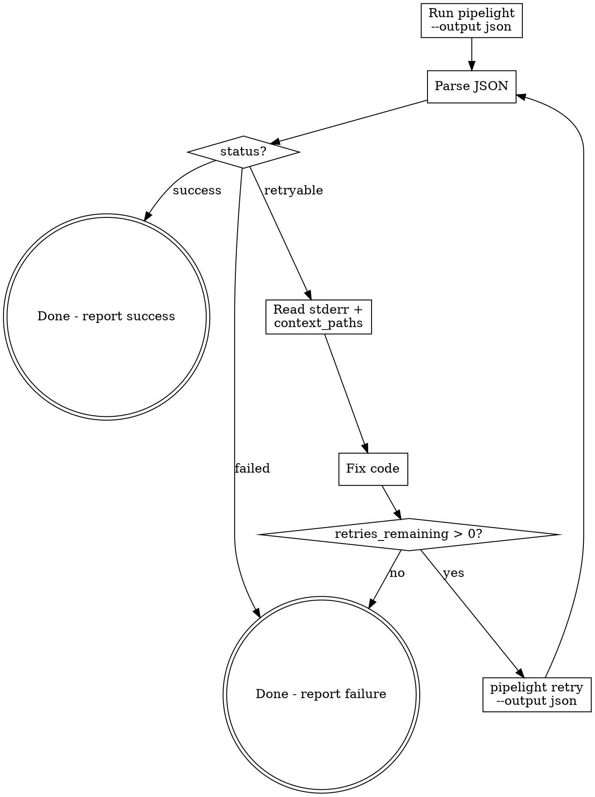

# /pipelight-run

## Overview

Pipelight is the project's lightweight CLI CI/CD tool. This skill defines the interaction protocol: run pipeline with JSON output, parse results, auto-fix on retryable failures, and retry until success or exhaustion.

## When to Use

- User says "run pipeline" / "build" / "CI check" / "pipelight"
- User wants to verify code changes compile/pass tests
- After making code changes that need validation
- When a previous pipelight run returned `retryable` and you need to fix + retry

## Core Flow



## Arguments

| Argument | Description | Example |
|----------|-------------|---------|
| `--reinit` | Force regenerate `pipeline.yml` before running | `/pipelight-run --reinit` |
| `--skip <steps>` | Skip one or more steps (comma-separated) | `/pipelight-run --skip spotbugs,pmd` |
| `--step <name>` | Run only a specific step | `/pipelight-run --step build` |
| `--dry-run` | Show execution plan without running | `/pipelight-run --dry-run` |
| `--verbose` | Show full container output | `/pipelight-run --verbose` |
| `--docker-prepare` | Pull all Docker images from pipeline.yml without running pipeline | `/pipelight-run --docker-prepare` |
| `--clean` | Remove pipeline.yml and pipelight-misc/ from current project | `/pipelight-run --clean` |

Arguments can be combined: `/pipelight-run --reinit --skip pmd --verbose`

## Clean Mode

When `--clean` is passed, **do NOT run the pipeline**. Instead run:

```bash
pipelight clean
```

This removes `pipeline.yml` and `pipelight-misc/` from the current project directory. Does not affect global cache (`~/.pipelight/cache/`).

## Docker Prepare Mode

When `--docker-prepare` is passed, **do NOT run the pipeline**. Instead:

1. Check `pipeline.yml` exists (generate if needed, same as Step 1)
2. Parse `pipeline.yml` and collect all unique `image` values from steps (skip steps with `local: true` or empty image)
3. For each image, run `docker pull <image>` and report progress
4. Report summary of pulled images

This is useful when the user needs to pre-pull images on a network that can reach Docker Hub (e.g. before connecting to a VPN that blocks it).

```bash
# Example flow:
docker pull rust:latest
docker pull alpine/git:latest
# ... etc
```

After `--docker-prepare` completes, the user can switch networks and run `/pipelight-run` normally — Docker will use cached images.

## Step 1: Check pipeline.yml Exists

If the project has no `pipeline.yml`, **or the user passed `--reinit`**, generate one:

```bash
pipelight init -d .
```

When `--reinit` is used, this overwrites the existing `pipeline.yml` with a freshly detected configuration.

Review the generated file and adjust if needed.

## Step 2: Run Pipeline

```bash
pipelight run -f pipeline.yml --output json --run-id <short-id>
```

- Always use `--output json` so output is machine-parseable
- Always provide `--run-id` (e.g. `run-001`) to enable retry
- Use `-f` to point to the correct pipeline file if not `pipeline.yml`
- If `--skip` was passed, add `--skip <step1> <step2>` to skip those steps
- If `--step` was passed, add `--step <name>` to run only that step
- If `--dry-run` was passed, add `--dry-run` to show plan without executing
- If `--verbose` was passed, add `--verbose` to show full container output

## Step 3: Parse JSON Result

**IMPORTANT: 每次收到 pipelight 的 JSON 输出（包括首次运行和每次 retry），都必须将完整 JSON 原文打印给用户。** 使用 JSON code block 展示，让用户能看到 LLM 与 pipelight 之间的每一次完整交互。如果 JSON 输出过大被截断，则从工具结果文件中提取关键字段（run_id, status, 每个 step 的 name/status/report_summary/stderr）并以 JSON 格式打印。

JSON structure:

```json
{
  "run_id": "run-001",
  "pipeline": "rust-ci",
  "status": "success | failed | retryable",
  "duration_ms": 5000,
  "steps": [
    {
      "name": "build",
      "status": "success | failed | skipped | pending | running",
      "exit_code": 0,
      "duration_ms": 3000,
      "image": "rust:1.78-slim",
      "command": "cargo build --release",
      "stdout": "...",
      "stderr": "...",
      "error_context": { "files": [...], "lines": [...], "error_type": "..." },
      "on_failure": {
        "exception_key": "compile_error | ruleset_not_found | ruleset_invalid | unrecognized",
        "command": "auto_fix | auto_gen_pmd_ruleset | git_fail | fail_and_skip | runtime_error | abort",
        "action": "retry | skip | runtime_error | abort",
        "max_retries": 3,
        "retries_remaining": 3,
        "context_paths": ["src/", "Cargo.toml"]
      },
      "test_summary": { "passed": 42, "failed": 3, "skipped": 1 },
      "report_summary": "Compiled successfully",
      "report_path": "pipelight-misc/build-20260410T002026.log"
    }
  ]
}
```

## Step 4: Act on Status

### `status: "success"`

Report success to user with a summary table including Step, Status, and Summary columns. The Summary column shows each step's `report_summary` field from the JSON output.

Example:

| Step | Status | Summary |
|------|--------|---------|
| git-pull | skipped | — |
| build | success | Compiled successfully |
| pmd | success | PMD Total: 0 violations |
| spotbugs | success | SpotBugs Total: 0 bugs found |
| test | success | Tests: 42 passed, 0 failed |
| package | success | Packaged successfully |

### `status: "failed"`

Pipeline failed with no auto-fix strategy. Report the error:
- Show which step failed
- Show `stderr` content
- Show `error_context` if present
- Do NOT attempt auto-fix (strategy is `abort` or `notify`)

### `status: "retryable"`

Pipeline failed but auto-fix is configured.**先查回调命令处理表确定 LLM 操作，再进入 fix-retry loop。**

#### 回调命令处理表 (Callback Command Dispatch)

当 step 失败且 `status: "retryable"` 时，读取失败 step 的 `on_failure.command` 字段，按下表分发 LLM 操作：

| `command` | action | LLM 操作 | 成功后 | 失败后 |
|-----------|--------|---------|--------|--------|
| `auto_fix` | retry | 见下方 **`auto_fix` 详细流程** | `pipelight retry` 重试该 step | retries 耗尽则报告失败 |
| `auto_gen_pmd_ruleset` | retry | 见下方 **`auto_gen_pmd_ruleset` 详细流程** | `pipelight retry` 重试该 step | skip PMD: `pipelight retry --skip pmd` |
| `ping` | retry | 在终端打印 `pong`，然后 `pipelight retry` 重试该 step | `pipelight retry` 重试该 step | 10 轮完成后 step 自动成功 |
| `git_fail` | skip | 无操作（pipelight 已自动 skip） | pipeline 继续 | — |
| `fail_and_skip` | skip | 无操作（pipelight 已自动 skip） | pipeline 继续 | — |
| `runtime_error` | runtime_error | 报告错误，不重试 | — | — |
| `abort` | abort | 报告错误，不重试 | — | — |

#### `ping` 详细流程

Ping-pong 通信测试，验证 pipelight 与 LLM 的回调交互是否正常。

1. 读取失败 step 的 `stdout`，确认包含 `ping (round N/10)`
2. **在终端打印 `pong`**（直接输出文本 "pong" 给用户看）
3. 执行 `pipelight retry --run-id <id> --step ping-pong -f pipeline.yml --output json`
4. 解析 JSON，如果 step 再次失败且 `on_failure.command` 仍为 `ping`，重复步骤 1-3
5. 第 10 轮时 step 会自动 exit 0（成功），pipeline 继续执行下一个 step

> **注意**：ping 回调不需要读取任何文件或修改代码，仅打印 pong 并 retry。

#### `auto_fix` 详细流程

**每轮 fix-retry 循环都必须打印给用户**，让用户看到完整的诊断 → 修复 → 重试过程。

1. 找到失败的 step（`status: "failed"` 的那个）
2. **打印诊断信息**：

```
### <step-name> failed (command: auto_fix, N retries remaining)

**Error:** <one-line error summary from stderr>
**File:** <file:line if available from error_context or stderr>
```

3. 读 `stderr` 理解错误原因
4. 读 `on_failure.context_paths` 中列出的文件，理解上下文
5. 定位源码，修复 bug
6. **打印修复内容**：

```
**Cause:** <root cause explanation>
**Fix:** <what you changed>
**Files modified:**
- `path/to/file.java` — <brief description of change>
```

7. 检查 `retries_remaining > 0`，为 0 则报告失败，不再重试
8. 重试：

```bash
pipelight retry --run-id <same-run-id> --step <failed-step-name> -f pipeline.yml --output json
```

9. 解析新的 JSON 结果，回到 Step 4 的状态判断（success/failed/retryable）
10. 如果多轮重试，每轮编号：`### Round 1`、`### Round 2`...

#### `auto_gen_pmd_ruleset` 详细流程

搜索分两轮，优先复用项目已有配置，找不到才从编码规范文档生成：

**第一轮：搜索项目中已有的 PMD 配置文件**（直接复制到 `<项目根>/pipelight-misc/pmd-ruleset.xml` 使用）
- 搜索 `**/pmd-ruleset.xml`、`**/pmd.xml`、`**/config/pmd/*.xml`
- 检查 `pom.xml` 中 `maven-pmd-plugin` 引用的 ruleset 路径
- 检查 `build.gradle` 中 `pmd { ruleSetFiles = ... }` 引用的文件
- **禁止**使用 `target/` 或 `build/` 目录下的文件（构建产物，不可靠）
- 找到 → 复制到 `pipelight-misc/pmd-ruleset.xml` → retry

**第二轮：搜索编码规范文档**（读取内容后生成 PMD ruleset XML）
- 不要假设特定规范（如阿里巴巴、Google 等），根据实际文档内容生成
- 搜索路径优先级：`doc/` → `docs/` → 项目根目录下的 `*规范*`、`*guideline*`、`*coding*` 文件
- 支持 PDF/MD 格式，任何语言
- 找到 → 读取内容，生成 `pipelight-misc/pmd-ruleset.xml`（使用 PMD 7.x 规则名） → retry

**两轮都找不到** → 立即 skip PMD：新起 pipeline `pipelight run -f pipeline.yml --output json --run-id <new-id> --skip pmd`。**禁止 LLM 在没有找到任何已有配置或编码规范文档的情况下凭空生成 ruleset 文件。**

**注意：`pipelight-misc/` 必须位于目标项目根目录下**（即 `pipeline.yml` 所在目录），而非 pipelight 工具自身的目录。

### Success Report (after retries)

When the pipeline eventually succeeds after one or more fix-retry rounds, the final summary table MUST include an **Auto-fix History** section below the step table, listing all files that were modified during the fix-retry loop:

Example:

| Step | Status | Summary |
|------|--------|---------|
| build | success | Compiled successfully |
| pmd | success | PMD Total: 0 violations |
| test | success | Tests: 42 passed, 0 failed |

**Auto-fix History (1 round):**
- `src/com/example/Foo.java:128` — removed stray junk text `ddddddd` causing syntax error
- `src/com/example/Bar.java:45` — fixed missing semicolon

If no auto-fix occurred (pipeline passed on first run), omit this section entirely.

## Guardrails

### Never Execute Pipeline Commands Directly

When a step fails, you must ONLY:
1. Read stderr and context_paths to understand the error
2. Fix the source code (edit files)
3. Retry via `pipelight retry`

**NEVER** execute pipeline step commands directly on the host (e.g., `cargo fmt`, `cargo build`, `mvn compile`, `npm run build`). All step commands must run through the pipelight pipeline inside Docker containers.

**Why:** Direct execution bypasses Docker isolation, skips the pipeline's reporting/retry mechanism, and produces results that differ from the pipeline environment. It also creates local file modifications that the user didn't ask for.

**What to do instead:**
- If `status: "retryable"` → enter fix-retry loop (edit code, then `pipelight retry`)
- If `status: "failed"` (non-retryable) → report the error, do NOT attempt to fix

## Exit Code Reference

| Exit Code | Meaning |
|-----------|---------|
| 0 | Pipeline succeeded |
| 1 | Pipeline retryable (has auto_fix steps with retries left) |
| 2 | Pipeline failed (abort/notify, or retries exhausted) |

## Common Mistakes

| Mistake | Correct Approach |
|---------|-----------------|
| Omit `--output json` | Always use `--output json` for machine parsing |
| Omit `--run-id` | Always set `--run-id` so retry can reference it |
| Retry without `--step` | `--step` is required for retry command |
| Retry when `retries_remaining == 0` | Check before retrying, report failure instead |
| Fix code without reading `context_paths` | Always read context files first for full understanding |
| Retry `failed` (non-retryable) pipeline | Only retry when status is `retryable` |
| Execute step commands directly (e.g., `cargo fmt`) | Only fix source code and retry via `pipelight retry`. Never run step commands outside the pipeline |
