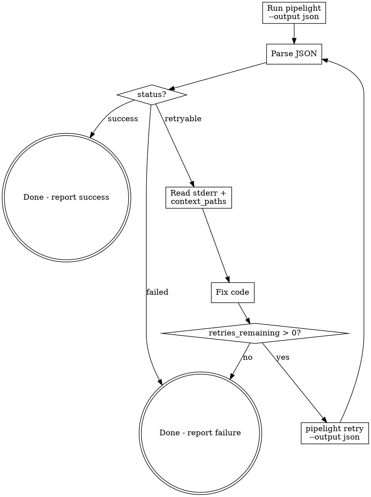

# /pipelight-run

## Overview

Pipelight is the project's lightweight CLI CI/CD tool. This skill defines the interaction protocol: run pipeline with JSON output, parse results, auto-fix on retryable failures, and retry until success or exhaustion.

## When to Use

- User says "run pipeline" / "build" / "CI check" / "pipelight"
- User wants to verify code changes compile/pass tests
- After making code changes that need validation
- When a previous pipelight run returned `retryable` and you need to fix + retry

## Core Flow



## Arguments

| Argument | Description | Example |
|----------|-------------|---------|
| `--reinit` | Force regenerate `pipeline.yml` before running | `/pipelight-run --reinit` |
| `--skip <steps>` | Skip one or more steps (comma-separated) | `/pipelight-run --skip spotbugs,pmd` |
| `--step <name>` | Run only a specific step | `/pipelight-run --step build` |
| `--dry-run` | Show execution plan without running | `/pipelight-run --dry-run` |
| `--verbose` | Show full container output | `/pipelight-run --verbose` |
| `--docker-prepare` | Pull all Docker images from pipeline.yml without running pipeline | `/pipelight-run --docker-prepare` |

Arguments can be combined: `/pipelight-run --reinit --skip pmd --verbose`

## Docker Prepare Mode

When `--docker-prepare` is passed, **do NOT run the pipeline**. Instead:

1. Check `pipeline.yml` exists (generate if needed, same as Step 1)
2. Parse `pipeline.yml` and collect all unique `image` values from steps (skip steps with `local: true` or empty image)
3. For each image, run `docker pull <image>` and report progress
4. Report summary of pulled images

This is useful when the user needs to pre-pull images on a network that can reach Docker Hub (e.g. before connecting to a VPN that blocks it).

```bash
# Example flow:
docker pull rust:latest
docker pull alpine/git:latest
# ... etc
```

After `--docker-prepare` completes, the user can switch networks and run `/pipelight-run` normally — Docker will use cached images.

## Step 1: Check pipeline.yml Exists

If the project has no `pipeline.yml`, **or the user passed `--reinit`**, generate one:

```bash
pipelight init -d .
```

When `--reinit` is used, this overwrites the existing `pipeline.yml` with a freshly detected configuration.

Review the generated file and adjust if needed.

## Step 2: Run Pipeline

```bash
pipelight run -f pipeline.yml --output json --run-id <short-id>
```

- Always use `--output json` so output is machine-parseable
- Always provide `--run-id` (e.g. `run-001`) to enable retry
- Use `-f` to point to the correct pipeline file if not `pipeline.yml`
- If `--skip` was passed, add `--skip <step1> <step2>` to skip those steps
- If `--step` was passed, add `--step <name>` to run only that step
- If `--dry-run` was passed, add `--dry-run` to show plan without executing
- If `--verbose` was passed, add `--verbose` to show full container output

## Step 3: Parse JSON Result

JSON structure:

```json
{
  "run_id": "run-001",
  "pipeline": "rust-ci",
  "status": "success | failed | retryable",
  "duration_ms": 5000,
  "steps": [
    {
      "name": "build",
      "status": "success | failed | skipped | pending | running",
      "exit_code": 0,
      "duration_ms": 3000,
      "image": "rust:1.78-slim",
      "command": "cargo build --release",
      "stdout": "...",
      "stderr": "...",
      "error_context": { "files": [...], "lines": [...], "error_type": "..." },
      "on_failure": {
        "strategy": "autofix | abort | notify",
        "max_retries": 3,
        "retries_remaining": 3,
        "context_paths": ["src/", "Cargo.toml"]
      },
      "test_summary": { "passed": 42, "failed": 3, "skipped": 1 }
    }
  ]
}
```

## Step 4: Act on Status

### `status: "success"`

Report success to user. Show step durations if relevant.

### `status: "failed"`

Pipeline failed with no auto-fix strategy. Report the error:
- Show which step failed
- Show `stderr` content
- Show `error_context` if present
- Do NOT attempt auto-fix (strategy is `abort` or `notify`)

### `status: "retryable"`

Pipeline failed but auto-fix is configured. Enter fix-retry loop:

1. Find the failed step (the one with `status: "failed"`)
2. Read `stderr` to understand the error
3. Read files listed in `on_failure.context_paths` to understand context
4. Fix the code
5. Check `retries_remaining > 0` before retrying
6. Run retry:

```bash
pipelight retry --run-id <same-run-id> --step <failed-step-name> -f pipeline.yml --output json
```

7. Parse the new JSON result and repeat from Step 4

## Exit Code Reference

| Exit Code | Meaning |
|-----------|---------|
| 0 | Pipeline succeeded |
| 1 | Pipeline retryable (has auto_fix steps with retries left) |
| 2 | Pipeline failed (abort/notify, or retries exhausted) |

## Common Mistakes

| Mistake | Correct Approach |
|---------|-----------------|
| Omit `--output json` | Always use `--output json` for machine parsing |
| Omit `--run-id` | Always set `--run-id` so retry can reference it |
| Retry without `--step` | `--step` is required for retry command |
| Retry when `retries_remaining == 0` | Check before retrying, report failure instead |
| Fix code without reading `context_paths` | Always read context files first for full understanding |
| Retry `failed` (non-retryable) pipeline | Only retry when status is `retryable` |
